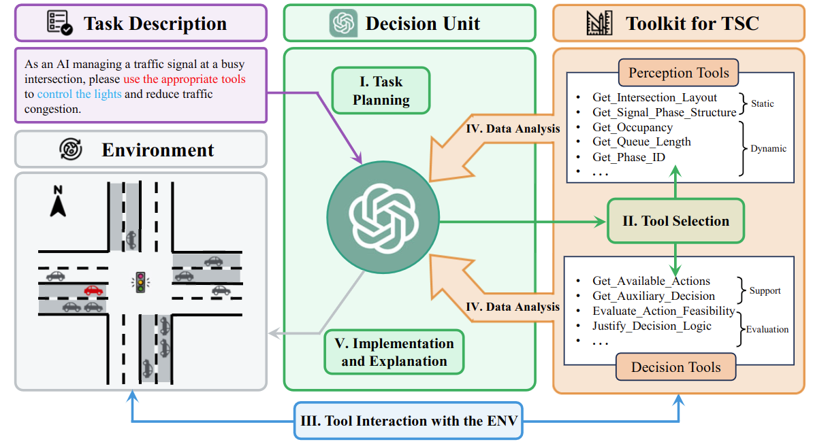

<!--
 * @Author: WANG Maonan
 * @Date: 2023-09-15 16:46:26
 * @Description: LA-Light README
 * @LastEditTime: 2025-07-10 22:15:19
-->
# 🚦 LLM-Assisted Light (LA-Light)

[](https://arxiv.org/abs/2403.08337)
[](https://opensource.org/licenses/Apache-2.0)
[](https://www.python.org/downloads/)


Official implementation of [LLM-Assisted Light: Augmenting Traffic Signal Control with Large Language Model in Complex Urban Scenarios](https://arxiv.org/abs/2403.08337).

## 📢 Latest News
- **[September 2025]** 🎉 **VLMLight accepted at NeurIPS 2025!** Congratulations! Our VLM-based traffic signal control paper has been accepted at NeurIPS 2025. [Paper Link](https://proceedings.neurips.cc/paper_files/paper/2025/hash/3849b5861dcaeaf4758eef0979a98cc6-Abstract-Conference.html)
- **[July 2025]** **Introducing [VLMLight](https://github.com/Traffic-Alpha/VLMLight)**: Our next-generation framework featuring **image-based traffic signal control** using Vision-Language Models (VLMs) for enhanced scene understanding and real-time decision-making.
- **[August 2023]** We have migrated the simulation platform used in this project from Aiolos to [TransSimHub](https://github.com/Traffic-Alpha/TransSimHub) (TSHub). We would like to express our sincere gratitude to our colleagues at SenseTime, **@KanYuheng (阚宇衡)**, **@MaZian (马子安)**, and **@XuChengcheng (徐承成)** (in alphabetical order) for their valuable contributions. The development of TransSimHub (TSHub) is a continuation of the work done on Aiolos.


## 🧩 Core Framework

Five-stage hybrid decision-making for human-AI collaborative traffic control:
1. **Task Planning**: LLM defines traffic management role  
2. **Tool Selection**: Dynamically invokes perception & decision tools  
3. **Environment Interaction**: Real-time traffic data collection  
4. **Data Analysis**: Decision unit generates control strategies  
5. **Execution Feedback**: Implements decisions with explainable justifications

<div align=center>
  
</div>

## 🧪 Quick Validation

### 🛠️ Installation

Install [TransSimHub](https://github.com/Traffic-Alpha/TransSimHub):
```bash
git clone https://github.com/Traffic-Alpha/TransSimHub.git
cd TransSimHub
pip install -e ".[all]"
```

### 🤖 RL Model Training & Evaluation

For training and evaluating the RL model, refer to [TSCRL](./TSCRL/). You can use the following command to start training:

```shell
python train_rl_agent.py
```

The [RL Result](./TSCRL/result/) directory contains the trained models and training results. Use the following command to evaluate the performance of the model:

```shell
python eval_rl_agent.py
```

### 🧠 Pure LLM Inference

To directly use LLM for inference without invoking any tools, run the following script:

```shell
python llm.py --env_name '3way' --phase_num 3 --detector_break 'E0--s'
```

### 🔀 LA-Light Joint Decision-Making

To test LA-Light, run the following script. In this case, we will randomly generate congestion on `E1` and the sensor on the `E2--s` direction will fail.

```shell
python llm_rl.py --env_name '4way' --phase_num 4 --edge_block 'E1' --detector_break 'E2--s'
```

The effect of running the above test is shown in the following video. Each decision made by LA-Light involves multiple tool invocations and subsequent decisions based on the tool's return results, culminating in a final decision and explanation.

[LLM_for_TSC_README.webm](https://github.com/Traffic-Alpha/LLM-Assisted-Light/assets/21176109/131281d9-831d-4e08-919c-2ee8ac3fd841)

Due to the video length limit, we only captured part of the first decision-making process, including:

- Action 1: Obtaining the intersection layout, the number of lanes, and lane functions (turn left, go straight, or turn right) for each edge.
- Action 3: Obtaining the occupancy of each edge. The -E3 straight line has a higher occupancy rate, corresponding to the simulation. At this point, LA-Light can use tools to obtain real-time road network information.
- Final Decision and Explanation: Based on a series of results, LA-Light provides the final decision and explanation.

## 🎥 Scenario Demos

[Scenario_1](https://github.com/Traffic-Alpha/LLM-Assisted-Light/assets/21176109/3075d18c-a6eb-4b5c-bdc9-f79936e13dc2)
<p align="center">Examples of LA-Lights Utilizing Tools to Control Traffic Signals <strong>(Normal Scenario)</strong></p>

[Scenario_2](https://github.com/Traffic-Alpha/LLM-Assisted-Light/assets/21176109/9062f888-314d-43f8-b668-9ad46471504c)
<p align="center">Examples of LA-Lights Utilizing Tools to Control Traffic Signals <strong>(Emergency Vehicle (EMV) Scenario)</strong></p>

## 📜 Citation

If you find this work useful, please cite our papers:

```bibtex
@inproceedings{NEURIPS2025_3849b586,
 author = {Wang, Maonan and Chen, Yirong and Pang, Aoyu and Cai, Yuxin and Chen, Chung Shue and Kan, Yuheng and Pun, Man On},
 booktitle = {Advances in Neural Information Processing Systems},
 editor = {D. Belgrave and C. Zhang and H. Lin and R. Pascanu and P. Koniusz and M. Ghassemi and N. Chen},
 pages = {39590--39621},
 publisher = {Curran Associates, Inc.},
 title = {VLMLight: Safety-Critical Traffic Signal Control via Vision-Language Meta-Control and Dual-Branch Reasoning Architecture},
 url = {https://proceedings.neurips.cc/paper_files/paper/2025/file/3849b5861dcaeaf4758eef0979a98cc6-Paper-Conference.pdf},
 volume = {38},
 year = {2025}
}

@article{wang2024llm,
  title={LLM-Assisted Light: Leveraging Large Language Model Capabilities for Human-Mimetic Traffic Signal Control in Complex Urban Environments},
  author={Wang, Maonan and Pang, Aoyu and Kan, Yuheng and Pun, Man-On and Chen, Chung Shue and Huang, Bo},
  journal={arXiv preprint arXiv:2403.08337},
  year={2024}
}
```

## 🤝 Open-Source Foundations

This project stands on the shoulders of these open-source giants:
- [TransSimHub](https://github.com/Traffic-Alpha/TransSimHub)
- [LangChain](https://github.com/hwchase17/langchain)
- [stable-baselines3](https://github.com/DLR-RM/stable-baselines3)

## 📮 Contact

If you have any questions, please report issues on GitHub.
